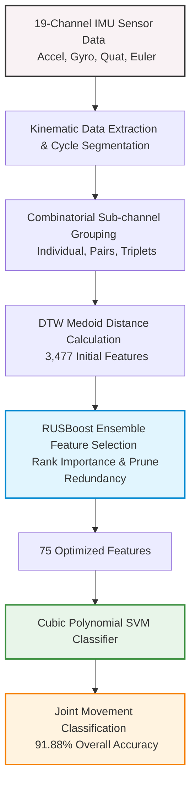

# Interpretable Joint Movement Classification via Combinatorial DTW Medoid Distances

> **Conference:** IISCC 2026  
> **Domain:** Biomedical Signal Processing, Wearable IMU Sensing, Applied Machine Learning  
> **Key Result:** Achieved **91.88% overall classification accuracy** using a 75-feature Cubic SVM.

###  Quick Links
* 📄 **[Download Full Research Paper (PDF)](IISCC2026_paper.pdf)**
* 📊 **[Download IISCC 2026 Slide Deck (PDF)](IISCC2026_presentation.pdf)**
---

##  Project Overview
Rehabilitation tracking requires accurate, interpretable classification of multi-joint physical exercises. This research presents an end-to-end Machine Learning framework using **19-channel wearable IMU sensor data** to classify upper-limb movements while accounting for joint coupling effects.

---

##  Methodology & Technical Architecture

1. **Kinematic Data Extraction:** Processed multi-channel IMU data across accelerometer, gyroscope, user acceleration, gravity, quaternion, and Euler angle metrics (19 sub-channels).
2. **Combinatorial Feature Engineering:** Generated cycle-level Dynamic Time Warping (DTW) medoid distance metrics across individual, paired, and triplet channel combinations (3,477 total initial features).
3. **Feature Selection:** Applied **RUSBoost ensemble feature selection** to rank predictor importance and remove redundancy.
4. **Classification Engine:** Evaluated performance using a **Cubic Polynomial Support Vector Machine (SVM)**.

---

##  Key Results & Performance Metrics

| Model Configuration | Feature Count ($N$) | Overall Accuracy | Key Finding / Trait |
| :--- | :--- | :--- | :--- |
| **Unpruned Baseline** | 3,477 | 87.60% | High dimensionality, redundant sub-channels |
| **Euclidean 1-NN** | — | 82.32% | Sensitive to speed variability across subjects |
| **Optimized Cubic SVM** | **75** | **91.88%** | **Optimal balance of accuracy & computational efficiency** |

* **High-Accuracy Joints:** Isolated wrist movements achieved peak accuracy (**96.04%**).
* **Kinematic Coupling Discovery:** Shoulder and elbow interactions exhibited bidirectional kinematic coupling, resulting in an elbow Average Precision (AP) of **0.624**.

---

## 📬 Contact & Citation
* **Author:** Elham
* **GitHub:** [elhamkedir88](https://github.com/elhamkedir88)
